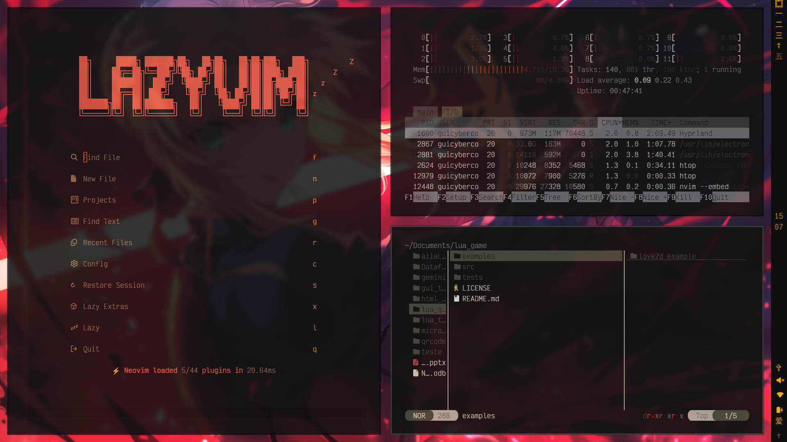

# guicybercode_omarchy
Dark discipline with crimson focus. guicybercode_omarchy leans on deep blacks, oxide reds, and muted metals for a calm-but-ready workspace. Workspaces display Mandarin numerals, and the current desktop is highlighted with a subtle Jesus cross motif so you always know where you are.

## Highlights
- Mandarin numerals for workspace indicators.
- Cross marker for the active desktop.
- Single bundled wallpaper to keep the setup consistent.
- Tuned for terminals, bars, and launchers with the same palette across configs.

## Preview


## Wallpaper
One bundled wallpaper is included in `backgrounds/` (set it as your desktop for the intended look).

## Installation
```bash
omarchy-theme-install https://github.com/guicybercode/guicybercode_omarchy.git
```

### Vesktop theme
Copy the CSS into your Vesktop themes directory:
```bash
cp system24-guicybercode_omarchy.css ~/.config/vesktop/themes/system24-guicybercode_omarchy.css
```
Select the theme inside Vesktop after copying.

## Apps and configs covered
- Terminal: `alacritty.toml`, `kitty.conf`, `ghostty.conf`
- System bars/OSD: `waybar.css`, `walker.css`, `swayosd.css`, `mako.ini`
- Window/session: `hyprland.conf`, `hyprlock.conf`
- Editors: `neovim.lua`, `vscode.json`
- Other: `btop.theme`, `chromium.theme`, `gtk.css`, `icons.theme`

## Notes
- Palette: deep black backgrounds, bronze/stone neutrals, and bright red/orange accents for focus states and borders.
- Workspace labeling uses Mandarin numerals; the active desktop uses a cross accent so you can spot it instantly.
- Keep the single wallpaper applied to match the preview.

### License
MIT
