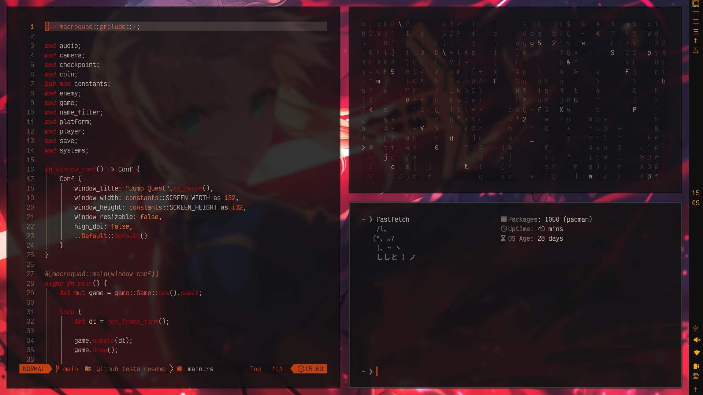

# guicybercode_omarchy
Dark discipline with crimson focus. Deep blacks, oxide reds, and muted metals for a calm-but-ready workspace. Workspaces use Mandarin numerals, and the active desktop carries a subtle cross marker for quick orientation.

## Highlights
- Single palette applied across shell, bars, lock screen, GTK, Discord/Vesktop, terminals, OSD, and Cursor.
- JetBrainsMono Nerd Font as the default everywhere (icons included).
- One wallpaper to keep the look coherent.
- Optional transparency (Hyprland, Waybar, Discord) and optional blur (Discord).

## Prerequisites
- Font: `ttf-jetbrains-mono-nerd` (Arch: `sudo pacman -S ttf-jetbrains-mono-nerd`).
- Wayland/Hyprland to apply window/bar/lock configs.

## Quick install
```bash
omarchy-theme-install https://github.com/guicybercode/guicybercode_omarchy.git
```
- Apply the wallpaper in `backgrounds/wallpaper.png`.
- If using Vesktop/Discord: copy the CSS (below).

## Preview



## File map
- Hyprland/lock: `hyprland.conf`, `hyprlock.conf`
- Bar/launcher/OSD: `waybar.css`, `walker.css`, `swayosd.css`, `mako.ini`
- Terminals: `alacritty.toml`, `kitty.conf`, `ghostty.conf`
- Discord/Vesktop: `system24-guicybercode_omarchy.css`
- GTK: `gtk.css`
- Cursor (VSCode engine): `cursor-theme.json`
- Other: `btop.theme`, `chromium.theme`, `icons.theme`, `doom-guicybercode_omarchy-theme.el`, `neovim.lua`, `vscode.json`

## Palette and font notes
- Base: #0F0F0F; accents in red/orange (#8B0000 / #FF4500) with stone/bronze neutrals.
- Global font: JetBrainsMono Nerd Font (already set in configs).

## How to apply (per app)

### Hyprland
- `hyprland.conf` sets wider gaps (`gaps_in = 8`, `gaps_out = 12`) and light opacity (`opacity 0.85 0.75`, fullscreen 1.0). Tweak and reload: `hyprctl reload`.

### Hyprlock
- `hyprlock.conf` has base colors; add wallpaper/blur if desired. Reload Hyprlock after editing.

### Waybar / Walker / OSD (swayosd, mako)
- `waybar.css` and `walker.css` use JetBrainsMono Nerd Font and the shared palette. Add `backdrop-filter: blur(...)` to the bar if your compositor supports it.
- `swayosd.css` / `mako.ini` follow the palette; adjust opacity as you like.

### Terminals
- `alacritty.toml`, `kitty.conf`, `ghostty.conf` already point to JetBrainsMono Nerd Font (size 12). Adjust `font_size`/`size` if needed.

### Discord / Vesktop
- Copy the theme:
```bash
cp system24-guicybercode_omarchy.css ~/.config/vesktop/themes/system24-guicybercode_omarchy.css
```
- Enable in Vesktop. For translucent look: set `--panel-blur: on` and make `--bg-*` use `hsla(..., 0.7–0.8)`.

### GTK
- `gtk.css` applies global font and colors; override sizes if you prefer.

### Cursor (VSCode engine)
- `cursor-theme.json`: open `~/.config/Cursor/User/settings.json` and paste/merge to apply font, UI, and syntax colors.

### Doom Emacs
```bash
mkdir -p ~/.doom.d/themes
cp doom-guicybercode_omarchy-theme.el ~/.doom.d/themes/
```
In `~/.doom.d/config.el`:
```elisp
(setq doom-theme 'doom-guicybercode_omarchy)
```

## Wallpaper
- Use `backgrounds/wallpaper.png` to match the palette.

##

태초에 하나님이 천지를 창조하시니라 (太初에 하나님이 天地를 創造하시니라) — 창세기 1:1
