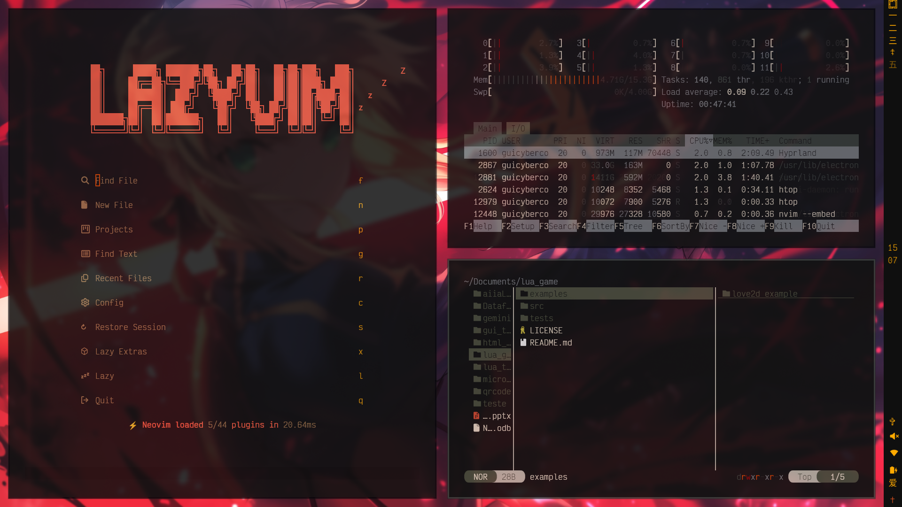
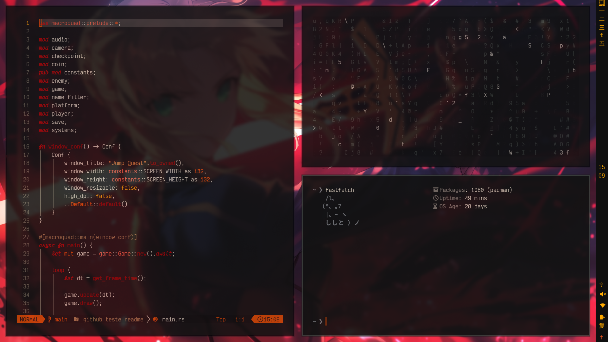

# guicybercode_omarchy
Dark discipline with crimson focus. Deep blacks, oxide reds, and muted metals for a calm-but-ready workspace.

## Highlights
- Single palette in `colors.toml`, applied by Omarchy across the shell (bar, menus, notifications, lock), terminals, btop, neovim, helix, chromium, obsidian and more.
- Amber bar text (`#ffaa00`) over near-black, via a `[bar]` section override.
- Muted sage active borders, wider gaps, and light window transparency — shipped inside the theme, not bolted onto your Hyprland config.
- One wallpaper to keep the look coherent.
- Optional multi-language keyboard support: Brazilian Portuguese, Korean, Thai, and Zhuyin (Chinese).

## Requirements
- **Omarchy 4.x** ("quattro"). This theme uses the `colors.toml` + template format.
  Older Omarchy releases are not supported; [`extras/`](extras/) keeps per-app
  reference configs for setups outside Omarchy.
- Font: `ttf-jetbrains-mono-nerd` (`sudo pacman -S ttf-jetbrains-mono-nerd`).

## Install
```bash
omarchy theme install https://github.com/guicybercode/guicybercode_omarchy.git
```
That clones the theme into `~/.config/omarchy/themes/guicybercode_omarchy` and applies it.
To switch later: `omarchy theme set guicybercode_omarchy`.

## Preview



## Palette

| Role | Hex |
|---|---|
| background | `#0f0f0f` |
| dark / darker background | `#0a0a0a` / `#05050a` |
| lighter background | `#1b1b1b` |
| foreground | `#e0d4c2` |
| selection | `#3a403b` |
| muted | `#7b726a` |
| accent | `#ff4500` |
| red / bright red | `#8b0000` / `#bf0000` |
| yellow (amber) | `#ffaa00` |

## What the theme ships

| File | Role |
|---|---|
| `colors.toml` | The palette. Everything else derives from it. |
| `hyprland.lua` | Border colors, `gaps_in 8` / `gaps_out 12`, `border_size 2`, `rounding 0`, and window opacity `0.85` / `0.75` (fullscreen stays `1.0`). Replaces Omarchy's generated `hyprland.lua`, so it defines the borders itself. |
| `shell.bar.toml` | `[bar]` override for the amber text. A `shell.<section>.toml` file **replaces** the whole section, so every key it needs is repeated there. |
| `neovim.lua` | Hand-tuned base16 mapping of the palette (aether.nvim). Also replaces Omarchy's generated `neovim.lua`. |
| `icons.theme` | `Yaru-sage` |
| `vscode.json` | Points VS Code at the Matte Black extension |
| `backgrounds/` | Wallpaper |

Everything else — alacritty, kitty, ghostty, foot, btop, helix, chromium, obsidian, claude — is **generated** from `colors.toml` by Omarchy's templates in `/usr/share/omarchy/default/themed/`. Omarchy renders a template only when the theme does not already provide that file, so the four overrides above win and the palette stays the single source of truth for the rest.

## Multi-language keyboard (optional)

Not part of the theme — Omarchy 4 keeps input configuration in `~/.config/hypr/`.
Three xkb layouts (br/kr/th) plus fcitx5 for Hangul and Zhuyin.

### Packages
```bash
sudo pacman -S --needed fcitx5-configtool fcitx5-hangul fcitx5-chewing
```
(`fcitx5`, `fcitx5-gtk` and `fcitx5-qt` come with Omarchy's `fcitx5-im` group.)

### Config
`~/.config/hypr/input.lua` — Brazilian Portuguese leads so Hyprland's Latin-keysym
bindings keep resolving:
```lua
hl.config({
  input = {
    kb_layout = "br,kr,th",
    kb_options = "compose:caps,shift:both_capslock_cancel",
  },
})
```

`~/.config/hypr/bindings.lua` — use `all`, not `current`: `current` only resolves for
the focused device and silently no-ops when dispatched from a binding.
```lua
o.bind("SUPER + I", "Cycle keyboard layout", "hyprctl switchxkblayout all next")
```

`~/.config/hypr/autostart.lua`:
```lua
if o.cmd_present("fcitx5") then
  o.launch_on_start("fcitx5 -d -r")
end
```

`~/.config/hypr/hyprland.lua` — Wayland-native apps reach fcitx5 through the
text-input protocol, so `GTK_IM_MODULE` is deliberately left unset (forcing it
breaks some Wayland apps). XWayland and Qt still need pointing at fcitx:
```lua
hl.env("XMODIFIERS", "@im=fcitx")
hl.env("QT_IM_MODULE", "fcitx")
```

### Shortcuts
- **`Super + I`** — cycle layouts (br → kr → th → br). The bar's
  `omarchy.keyboard-layout` widget shows the active one.
- **`Ctrl + Space`** — toggle fcitx5 (Hangul and Zhuyin).

### First-time setup
1. Install the packages above.
2. Run `fcitx5-configtool` and add **Hangul** (Korean) and **Chewing** (Zhuyin).
3. Log out and back in so the environment variables take effect.

### Per language
- **🇧🇷 Portuguese** and **🇹🇭 Thai** — direct xkb layouts. `Super + I`, then type.
- **🇰🇷 Korean** and **🇹🇼 Chinese** — the `kr` layout alone will not compose Hangul.
  Use `Ctrl + Space` to activate fcitx5 with the Hangul / Chewing input method.

### Troubleshooting
```bash
pgrep -x fcitx5                       # running?
killall fcitx5 && fcitx5 -d --replace # restart
hyprctl reload                        # reload Hyprland
hyprctl devices -j | jq '.keyboards[] | {name, active_keymap, layout}'
```
Some Electron apps need `--enable-wayland-ime`. Restart an app after fcitx5 starts.

## extras/

Configs from the old (Omarchy 2.x, Omarchist-era) format and for apps outside
Omarchy's theme system. Kept for reference and for non-Omarchy setups.

Omarchy 4 does not read any of this — the configs for apps it still themes are
generated from `colors.toml` instead.

- Per-app palettes, useful if you run these outside Omarchy: `alacritty.toml`,
  `kitty.conf`, `ghostty.conf`, `btop.theme`, `chromium.theme`
- `custom_theme.json` — the original Omarchist source file, kept as provenance
- Never part of Omarchy theming, apply by hand:
  - **Discord/Vesktop**: `cp extras/system24-guicybercode_omarchy.css ~/.config/vesktop/themes/`
  - **GTK**: `extras/gtk.css`
  - **Cursor (VS Code engine)**: merge `extras/cursor-theme.json` into `~/.config/Cursor/User/settings.json`
  - **Doom Emacs**: `cp extras/doom-guicybercode_omarchy-theme.el ~/.doom.d/themes/` then
    `(setq doom-theme 'doom-guicybercode_omarchy)`

##

태초에 하나님이 천지를 창조하시니라 (太初에 하나님이 天地를 創造하시니라) — 창세기 1:1
